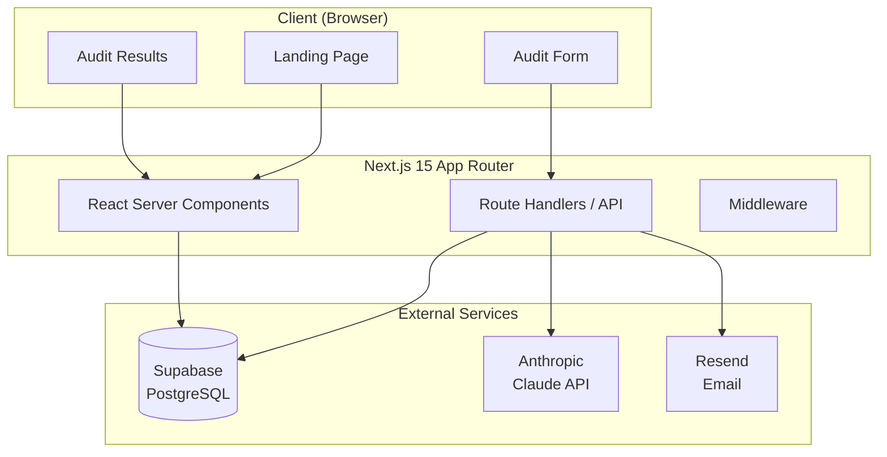

# ARCHITECTURE.md

> System architecture, data flow, and stack justifications for SpendScope.

---

## System Diagram



---

## Data Flow

### Audit Submission (Step 2)

1. User fills out the audit form (client-side)
2. Form submits to `/api/audits` Route Handler
3. Server validates input with Zod
4. Audit engine calculates spend + savings
5. Result is written to Supabase `audits` table
6. A unique slug is generated and returned
7. User is redirected to `/audit/[slug]`

### Audit Results Page (Step 2)

1. Next.js RSC fetches audit by slug from Supabase
2. Claude API generates AI summary (Step 3)
3. Results are rendered server-side (SEO-friendly)
4. Shareable URL is displayed

---

## Stack Justification

| Choice | Rationale |
|---|---|
| **Next.js 15 App Router** | RSC for SEO, streaming for performance, native TypeScript support |
| **Supabase** | Managed PostgreSQL with typed client, real-time ready, Vercel-compatible |
| **shadcn/ui** | Accessible component primitives, not a locked-in library — we own the code |
| **Tailwind CSS v4** | Design system tokens, responsive utilities, no runtime overhead |
| **Anthropic Claude** | Best-in-class long-context reasoning for audit summary generation |
| **Resend** | Developer-first email API with React Email support |
| **Zod** | Runtime type safety for all external data (forms, API, env vars) |

---

## Database Schema (Planned — Step 2)

```sql
-- audits: Stores completed audit sessions
CREATE TABLE audits (
  id          UUID PRIMARY KEY DEFAULT gen_random_uuid(),
  slug        TEXT UNIQUE NOT NULL,
  created_at  TIMESTAMPTZ DEFAULT now(),
  tools       JSONB NOT NULL,
  team_size   INTEGER NOT NULL,
  monthly_spend NUMERIC(10,2) NOT NULL,
  potential_savings NUMERIC(10,2) NOT NULL,
  ai_summary  TEXT,
  metadata    JSONB DEFAULT '{}'
);

CREATE INDEX idx_audits_slug ON audits(slug);
```

---

## Performance Targets

| Metric | Target |
|---|---|
| Lighthouse Performance | >= 85 |
| Lighthouse Accessibility | >= 90 |
| Lighthouse Best Practices | >= 90 |
| LCP | < 2.5s |
| CLS | < 0.1 |
| TTFB | < 400ms (Vercel Edge) |
